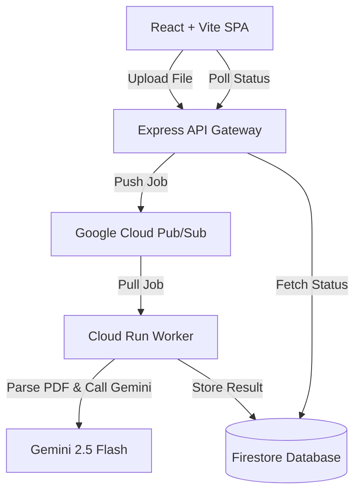

# DocIntel AI — Raw Papers to Structured Signals

DocIntel AI (formerly DocuMind AI) is an industrial-grade document intelligence platform and visual dashboard. It allows you to process complex documents (like invoices, resumes, and legal papers) using a scalable, async AI pipeline.

This repository contains the client-side Single Page Application (SPA) built using **React, Vite, Tailwind CSS v4, and TypeScript**.

## Features

- **Drag-and-Drop Dropzone**: Sleek interface supporting PDF, TXT, and Markdown files up to 20MB.
- **Async Processing Pipeline**: Real-time progress visualization showing layout recognition, Gemini AI analysis, and structured JSON generation stages.
- **Interactive JSON Viewer**: Displays live-parsed structured signals extracted from documents.
- **Visual Intelligence Console**: Deep analytics panel showing document summaries, key metadata (document type, confidence score, language), extracted entities (with confidence levels), and full details.
- **Local History Tracking**: Document records and analysis history are saved client-side using `localStorage`.
- **Client-Side PDF Parsing**: Robust offline text extraction using `pdfjs-dist` worker threads.

## Architecture



---

## Tech Stack

- **Core**: React 19, TypeScript 5, Vite 7
- **Styling**: Tailwind CSS v4 (using the `@tailwindcss/vite` compiler plugin)
- **Routing**: React Router DOM (Vite SPA mode)
- **Query Management**: TanStack React Query v5
- **UI Components**: Radix UI primitives & Lucide React icons
- **Notifications**: Sonner

---

## Getting Started

### Prerequisites

- Node.js (v18 or higher recommended)
- `npm` or `bun`

### Installation

1. Install dependencies:
   ```bash
   npm install
   ```

2. Start the local development server:
   ```bash
   npm run dev
   ```
   The app will run locally at [http://localhost:8080/](http://localhost:8080/).

### Production Build

To build the static application assets:
```bash
npm run build
```
This outputs minified static assets in the `/dist` directory, ready to be hosted on static hosting services (like Vercel, Netlify, or GitHub Pages).

---

## Deployment on Vercel

The application is fully configured as a Single Page Application for Vercel. 

- Routes are rewritten client-side via `vercel.json` to ensure routing handles `index.html` fallback correctly without 404s.
- Environment variables should be configured directly in your Vercel Project Settings if your backend requires them.
